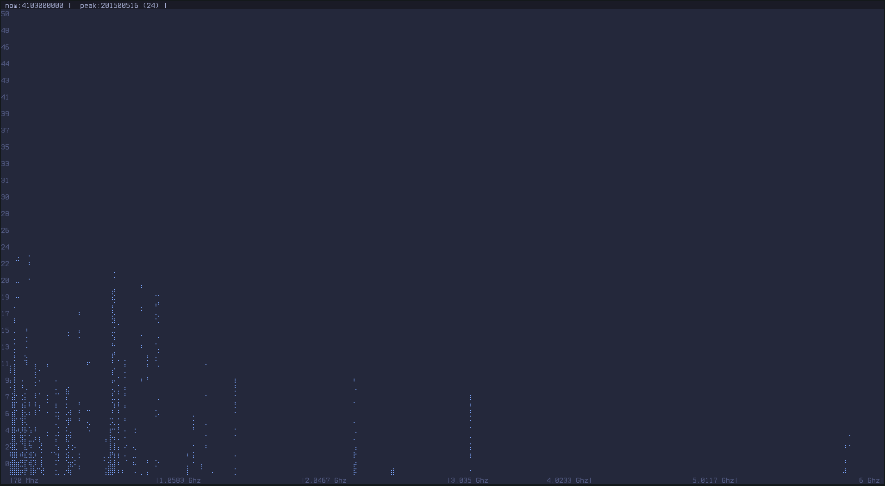

SigKit
======

A set of command line tools for visualizing (and hopefully eventually manipulating) RF signals.

Currently includes a signal seeker and scanner. Future plans include some form of basic signal generation, identification, and maybe decoding.

## Why?

Initially more of an art project/experiment to see if I could get any useful RF visualization on a terminal only. I was happy with the results and I enjoy using the terminal, so I'm trying to flesh it out into something useful.

In practical terms, the intention is to allow casual RF cruising directly from a terminal, potentially remote, without a GTK popup or other GUI.

It's not a replacement for a real scanner, text just doesn't have the fidelity for that, but it can give some idea.

## Requirements:

### SDR
- ADALM-PLUTO (or compatible)
    - [pyadi-iio](https://pypi.org/project/pyadi-iio/)
    - Assumes you've [updated to AD9364](https://wiki.analog.com/university/tools/pluto/users/customizing#updating_to_the_ad9364) for LO range and bandwidth. Use narrower available values if not.
- Support for RTL-SDR coming soon.

### Software
- Python 3.10
- Some kind of modern terminal emulator like kitty, alacritty or foot.

## Install:

Clone and `pip install -r requirements.txt`.

Note that it does require matplotlib, but only to generate colormaps.

# Usage

Invoke with `python [tool].py [options]`.

All tools run as full screen terminal applications. Ctrl+C exits.

## sigseek
Continuously scans a target frequency range, plotting dbfs vs frequency as a scatter plot where dbfs exceeds some threshold (0 by default.)

Running without options will scan entire available frequency range. See `--help` for more options.

```
Usage: sigseek.py [options]

Options:
  -h, --help            show this help message and exit
  -f FRANGE, --frange=FRANGE
                        frequency range expressed as min:max. defaults to
                        radio range.
  -l LINGER, --linger=LINGER
                        number of samples to collect before moving to next
                        frequency. default 20.
  -p MINDBFS, --mindbfs=MINDBFS
                        record signals above this dbfs threshold. default 0.

  FFT:
    --fftsize=FFTSIZE   rx buffer and fft size. default 1024.
    --nperseg=NPERSEG   welch's method segment size. set to fft size to use
                        faster non-segmented periodogram. default fftsize/4.
    --window=WINDOW     any scipy windowing function that doesn't require
                        parameters (boxcar, blackman, hamming, hann, etc).
                        default hann.

  Radio:
    -r RATE, --rate=RATE
                        iq sample rate/bandwidth/step size. default 1000000
                        hz.
    --gain=GAIN         rx gain in db, or auto attack style (fast or slow).
                        default fast

  Display:
    --style=STYLE       visual style. options are tokyonight, cyberpunk.
                        default tokyonight
```

Look for local FM radio stations from 80 to 105mhz. Each line represents a separate station, with the height indicating reception strength.

`python sigseek.py -f80000000:105000000`


Scan all available frequencies. This is a rural area, so we see a cluster of VHF/UHF (FM radio, HAM, marine, etc) and only a bit of WiFi/cellar, etc.

`python sigseek.py`



## sigscan

Scans a selected center frequency at a selected rate and displays a live PSD plot and/or waterfall.

The visualizer can be selected with `-v`/`--visualizers` as a comma-separated list. If one is selected, it's shown fullscreen. If two, the first takes up the top 35% of the screen and the second the remainder. For example, `psd,waterfall` (the default) will draw a smaller psd plot at the top and a larger waterfall at the bottom.

### Controls:
WASD-style key navigation.
- `A`/`a`/`[` - "pan left", increase center frequency by 10mhz, 0.1mhz or 100kz.
- `D`/`d`/`]` - "pan right", decrease center frequency by 10mhz, 0.1mhz or 100kz.
- `W`/`w` - "zoom in", decrease sample rate by 10mhz or 0.1mhz
- `S`/`s` - "zoom out", increase sample rate by 10mhz or 0.1mhz
- `c`, `p`, `f` - toggle fullscreen constellation, psd or waterfall


```
Usage: sigscan.py [options]

Options:
  -h, --help            show this help message and exit

  Scanner:
    -f FREQUENCY, --frequency=FREQUENCY
                        centre frequency. increase or decrease respectively
                        with d/D/] and a/A/[ (medium/coarse/fine.) default
                        100000000 hz
    --mindbfs=MINDBFS   plot min dbfs. default -50.
    --maxdbfs=MAXDBFS   plot max dbfs. default 40.

  FFT (if applicable):
    --fftsize=FFTSIZE   rx buffer and fft size. default 1024.
    --nperseg=NPERSEG   welch's method segment size. set to fft size to use
                        non-segmented periodogram. default fftsize/4.
    --window=WINDOW     any scipy windowing function that doesn't require
                        parameters (boxcar, blackman, hamming, hann, etc).
                        default hann.

  Radio:
    -r RATE, --rate=RATE
                        iq sample rate/bandwidth/step size. increase or
                        decrease respectively with w/W and s/S
                        (medium/coarse.) default 1000000 hz.
    --gain=GAIN         rx gain in db, or auto attack style (fast or slow).
                        default fast.

  Display:
    -v VISUALIZERS, --visualizers=VISUALIZERS
                        comma-separated list of visualizers. available options
                        are [p]sd, water[f]all and [c]onstellation. you can
                        toggle between a fullscreen version of each and your
                        selected visualizers with the keys in brackets. default
                        psd,waterfall.
    --fps=FPS           frames (or rows) to display per second, 0 to not
                        throttle. default 0.
    --style=STYLE       visual style. options are tokyonight, cyberpunk.
                        default tokyonight.
```

Scan 2.4ghz with default options.

`python sigscan.py -f2400000000 --style=cyberpunk`


Scan 98.5mhz with a larger sample buffer.

`python sigscan.py -f98500000 --style=cyberpunk --fftsize=4096`


Random panning with default options.

`python sigscan.py`


Show PSD and constellation plot at 120mhz.

`python sigscan.py -f120000000 --visualizers=psd,constellation`


#### TODO
- more keyboard control (gain)
